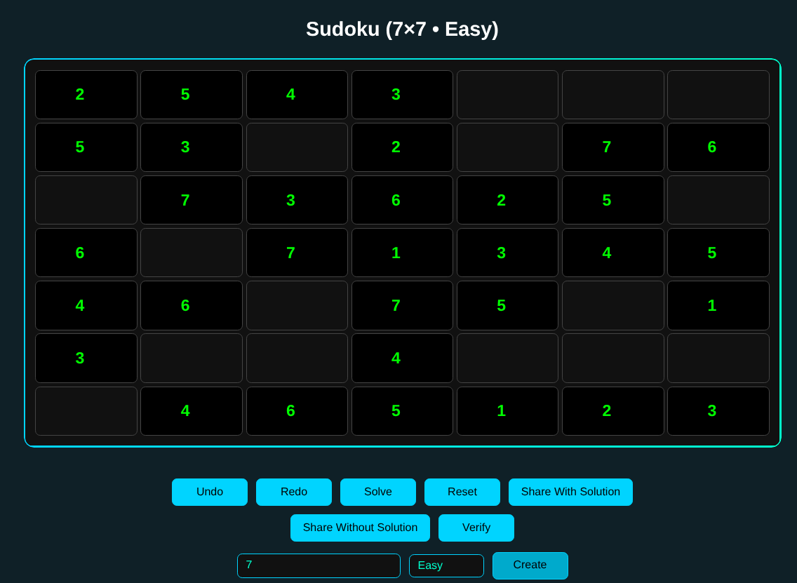
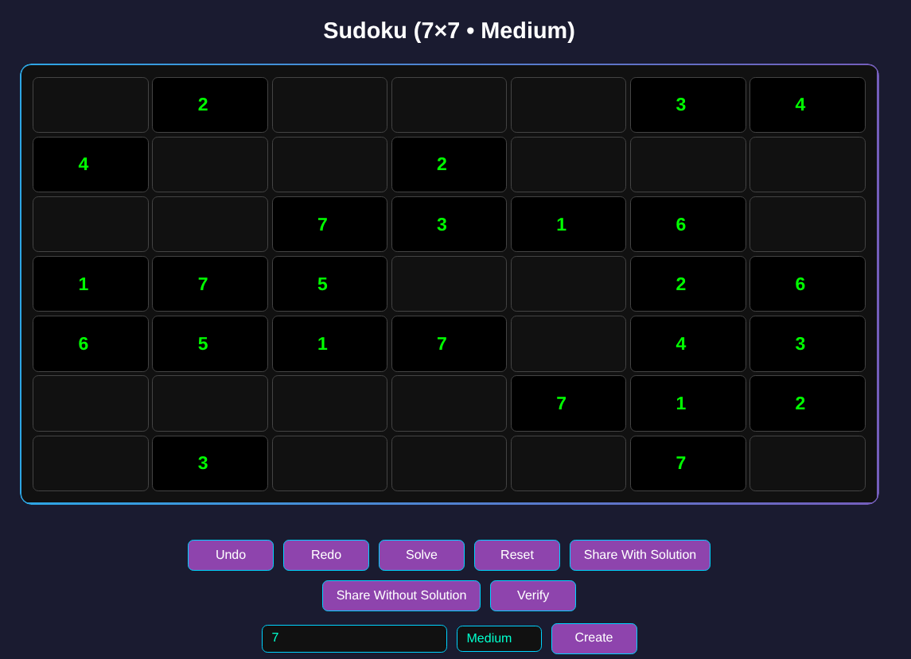
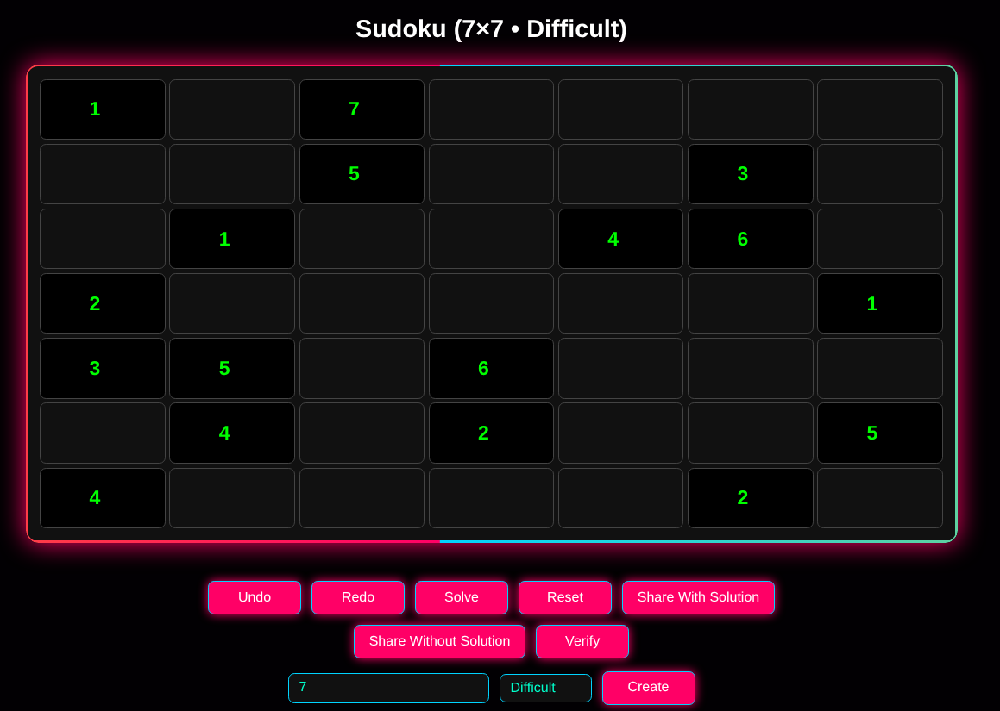

# Sudoku - Puzzle Game

A lightweight Sudoku puzzle generator and player built with **Rust + WebAssembly**.

👉 [&gt;&gt;Click Here&lt;&lt;](https://biswajitthakur.github.io/sudoku-puzzle-game/) to play online

## Features

- Sudoku generation (Rust core)
- Supports dynamic sizes (N x N, N ≤ 14)
- Difficulty levels:
  - Easy
  - Medium
  - Difficult
- Shareable game links (encoded in URL)
- Option to include/exclude solution in shared link

## Setup & Run

1. [Install Rust](https://rust-lang.org/tools/install/)
2. Install [wasm-pack](https://github.com/wasm-bindgen/wasm-pack):

```bash
cargo install wasm-pack
```

3. Clone & build

```bash
git clone https://github.com/BiswajitThakur/sudoku-puzzle-game.git
cd sudoku-puzzle-game
wasm-pack build --target web
```

4. Start the dev server
```bash
python -m http.server 8080

# then open http://127.0.0.1:8080 in your browser
```

## 📸 Screenshots




## Contributing

Contributions are welcome! If you find any bugs, want to request a new feature or improve the code feel free to open an issue or submit a pull request.

## License

This project is licensed under the MIT License. See the [LICENSE](./LICENSE) file for details.
